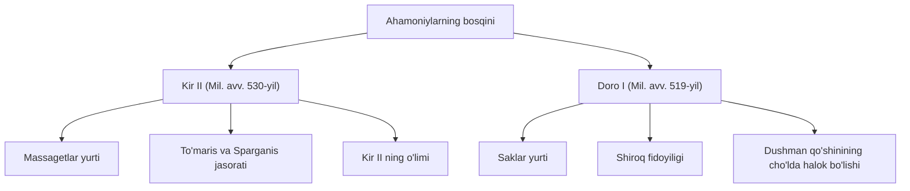

**O'zbekiston Tarixi — 28-mavzu: To'maris va Shiroq jasorati**

**Darvoza iqtibosi (Gate Quote)**
> "Ona Vatan himoyasi uchun jon fido qilgan qahramonlar xotirasi xalq qalbida mangu yashaydi."

---

**1-Panel: Xulosa (Summary)**
Miloddan avvalgi VI asr o'rtalarida Eron hududida hukmronlik qilgan ahamoniylar sulolasi Vatanimizni bosib olish maqsadida yurish boshladi. Dastlab, shoh Kir II miloddan avvalgi 530-yilda massagetlar yurtiga bostirib kirdi. Lekin massagetlar malikasi To'maris o'zining mislsiz jasorati va matonati bilan bosqinchilarni tor-mor etib, shoh Kir II ni o'ldirdi. Keyinchalik, miloddan avvalgi 519-yilda yana bir Eron hukmdori Doro I saklar qabilasiga qarshi qo'shin tortdi. Bu safar oddiy cho'pon Shiroq Vatan ozodligi yo'lida o'z jonini fido qildi; u dushman qo'shinini suvsiz cho'lga adashtirib boshlab kirib, ularni halokatga uchratdi. Ushbu ikki qahramonlik o'zbek davlatchiligi tarixida Vatan himoyasi yo'lidagi eng buyuk jasorat namunalari bo'lib qoldi.

---

**2-Panel: Yaxshiroq tushuntirish (Better Explanation)**
Ahamoniylarning O'rta Osiyoga yurishi ikkita yirik va muhim voqea bilan tarixga kirdi:

1. **To'maris jasorati:** Kir II bosqinchilik yurishi vaqtida To'marisning o'g'li Sparganisni hiyla yo'li bilan asirga oldi. Sparganis dushman asirligida yashashni xohlamay, or-nomus tufayli o'z joniga qasd qildi. O'g'lining o'limidan g'azabga to'lgan va Vatanining qasosini olishga ont ichgan To'maris shoh Kir II qo'shini bilan ayovsiz jang qildi. G'alabaga erishgan malika Kir II ning boshini qon to'ldirilgan meshga soldi va unga jazo berdi. 
2. **Shiroq fidoyiligi:** Doro I ning bosqini davrida saklar qabilasining harbiy kuchlari dushmanga nisbatan teng emas edi. Vatandoshimiz Shiroq bosqinchilarni halok qilish rejasini o'ylab topdi. U qabiladoshlariga o'zining quloq va burnini kesishlarini so'radi. Qon va yaraga belangan holda Doro I qarorgohiga borib, o'z qabilasidan jabr ko'rgan insondek dushman ishonchini qozondi. So'ngra yov qo'shinini eng qisqa yo'ldan olib borishga va'da berib, ularni jazirama sahroning markaziga olib kirdi va u yerda oziq-ovqatsiz qolgan Eron qo'shini qirilib ketdi.

---

**3-Panel: Namunalar / Birlamchi manba (Primary Source)**
Tarixiy manbalarda To'marisning Kir II ga yozgan maktubi va uning o'limidan so'ng aytgan so'zlari saqlanib qolgan:
*Jang oldidan:* «O, qonxo'r Kir! Maqtanma, o'g'limni ochiq jangda emas, hiyla yo'li bilan yengding. Endi yurtingga qayt! Aks holda tangrim nomi bilan qasam ichamanki, seni o'z qoningga to'ydiraman».
*Jangdan so'ng (Kirning boshini qonli meshga solib):* «O'g'limni o'ldirding, yurtimning qonini ichmoqchi bo'lding. Tirikligingda inson qoniga to'ymagan eding. Mana, endi to'yguningcha ich, qonxo'r!»

Shiroqning Doro I ning qo'mondonlariga qarata aytgan so'nggi so'zlari ham mardlik nidosidir:
«Men bir o'zim Doro I qo'shinini yengdim. Vatandoshlarimni esa o'lim va talon-tarojdan saqlab qoldim. Dushman qo'shini halokatga mahkumdir!»

---

**Xotira Saroyi (Memory Palace)**
Tasavvurimizda qadimgi Turon cho'llari va jang maydonlariga virtual sayohat qilamiz.

* **Saroy bekati: 1 — Amudaryo sohili:** Katta daryo yoqasida turibsiz. Narigi sohildan Fors podshosi Kir II minglab qo'shini bilan suvlarni kechib o'tib, qadimgi massagetlar yurtiga bostirib kirib kelayotganini ko'rasiz.
* **Saroy bekati: 2 — Asirlar chodiri:** Dushman qarorgohida malika To'marisning yosh va mag'rur o'g'li Sparganis zanjirband etilgan. U xoinlarcha asir bo'lgani uchun nomusga chiday olmay, soqchining xanjarini tortib olib o'ziga urayotgan fojiali onni ko'rasiz.
* **Saroy bekati: 3 — Qonli mesh maydoni:** Katta jangdan keyingi maydon. Malika To'maris g'alaba nashidasi bilan atrofga qaraydi. Uning oyog'i ostiga Kir II ning kesilgan boshi tashlangan. Malika bu boshni qon to'la teridan qilingan katta meshga solib, adolatli g'azab bilan so'zlayotganini kuzatasiz.
* **Saroy bekati: 4 — Quloq-burni kesilgan cho'pon chodiri:** Oradan yillar o'tib, saklar makonidasiz. Vatandoshimiz Shiroq chodir ichida o'z ixtiyori bilan quloq va burnini kestirib, qonga belangan holda shoh Doro I ning ishonchini qozonishga otlanmoqda.
* **Saroy bekati: 5 — Jazirama sahro markazi:** Cheksiz cho'l o'rtasida issiqdan sillasi qurigan, chanqoqdan nobud bo'layotgan Doro I askarlarini ko'rasiz. Shiroq esa baland qum tepaligida turib dushmanlar ustidan faxr va nido bilan qah-qah urib kulmoqda.

---

**6-Panel: Nega bu muhim (Why This Matters)**
To'maris va Shiroq kabi tarixiy siymolar shunchaki o'tmish qahramonlari emas, balki millatimiz qonida oqayotgan vatanparvarlik tuyg'usining eng oliy timsolidir. Ular Vatan ozodligi va or-nomus har qanday boylikdan, hatto, insonning o'z jonidan ham azizroq ekanini isbotlab berishgan. Dushman qanchalik qudratli va ayyor bo'lmasin, o'z yurtini himoya qilayotgan xalqning mustahkam irodasini sindira olmasligi o'sha davrdan bugungacha yorqin haqiqat bo'lib kelmoqda.

*O'ylab ko'ring:* Agar siz ana shunday og'ir sinov davrida yashaganingizda, Vatan mudofaasi uchun qanday qurbonliklarga tayyor bo'lar edingiz? Ushbu qahramonliklardan olingan ibrat orqali o'z BOST maqsadingizni belgilang.