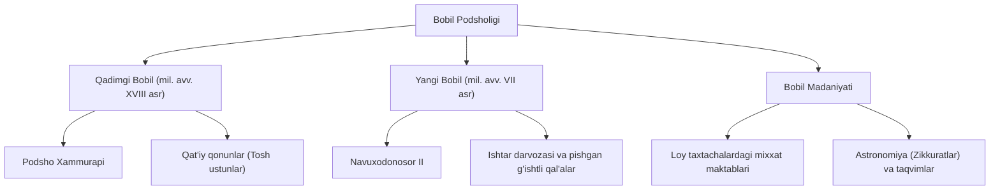

**Jahon Tarixi — 12-mavzu: Bobil podsholigi**

**Darvoza iqtibosi (Gate Quote)**
> "Qonun hammaga barobar bo'lgandagina adolat o'rnatiladi, adolatli jamiyat esa asrlar osha barhayot yashaydi."

---

**1-Panel: Xulosa (Summary)**
Mesopotamiyaning janubida miloddan avvalgi II mingyillikda qudratli Bobil davlati vujudga keldi. Frot va Dajla daryolari oralig'ida joylashgan bu shahar tez orada savdo-sotiq, hunarmandchilik va ilm-fan markaziga aylandi. Miloddan avvalgi XVIII asrda podsho Xammurapi butun Mesopotamiyani birlashtirib, insoniyat tarixidagi eng mashhur va qat'iy qonunlar to'plamini yaratdi. Oradan asrlar o'tib, miloddan avvalgi VII asrda Navuxodonosor II boshqaruvida Yangi Bobil podsholigi yuksalish cho'qqisiga chiqdi. Uning davrida ajoyib saroylar va ma'buda Ishtar darvozasi kabi muhtasham inshootlar bunyod etildi. Biroq bu qudratli saltanat abadiy qolmadi — miloddan avvalgi 539-yilda Bobil forslar tomonidan bosib olinadi.

---

**2-Panel: Yaxshiroq tushuntirish (Better Explanation)**
Bobil podsholigi (uning nomi "xudolar darvozasi" ma'nosini anglatadi) tarixida ikki buyuk hukmdor alohida o'rin tutadi:

1. **Podsho Xammurapi (mil. avv. XVIII asr):** U tarqoq Mesopotamiyani yagona davlatga birlashtirdi. Uning eng katta xizmati barcha shaharlarda o'rnatilgan tosh ustunlarga yozib qo'yilgan qat'iy qonunlar edi. Bu qonunlar jamiyatda tartib va intizomni ta'minlashga qaratilgan.
2. **Navuxodonosor II (mil. avv. VII asr):** U Yangi Bobil podsholigini eng qudratli davlatga aylantirdi. Uning qo'shini Misrni va Iyerusalim (Quddus)ni bosib oldi. U Bobilni pishgan g'ishtdan qurilgan mustahkam qal'alar va afsonaviy hayvonlar tasviri tushirilgan sakkizta darvozaga (shulardan eng mashhuri Ishtar darvozasi) ega bo'lgan go'zal shaharga aylantirdi.

Shuningdek, Bobilda ta'lim va fan yuksak darajada rivojlangan. Zodagonlarning bolalari maxsus maktablarda qamish tayoqchalar bilan nam loy taxtachalarga mixxatda yozishni o'rganishgan. Ular tibbiyot, geografiya va astronomiyada ulkan yutuqlarga erishib, Quyosh (365 kun) va Oy (354 kun) taqvimlarini yaratganlar.

---

**3-Panel: Namunalar / Birlamchi manba (Primary Source)**
Xammurapi qonunlari nihoyatda qat'iy bo'lib, u nomigagina podshoning qarori bo'lmasdan, "ma'budlar xohish-irodasi" sifatida talqin qilingan va hamma uchun birdek majburiy bo'lgan. Darslikda bu shafqatsiz, ammo intizom o'rnatuvchi qonunlarning ba'zi namunalari keltirilgan:

* "Agar shifokor amalga oshirgan jarrohlik muolajasi natijasida bemor bevaqt vafot etsa, shifokorning qo'llari kesib tashlanishi shart."
* "Mabodo binokor qurgan uy to'satdan qulab, biror kishini bosib qolsa, binokor qatl etilishi lozim."
* "Yong'in mahalida o'g'rilik ustida qo'lga tushgan kimsa o'sha zahoti olovga tashlangan. Qulfbuzar o'g'ri esa... o'zganing mulkiga tajovuz qilgan joyida o'ldirilgan va ko'mib yuborilgan."

Bu qonunlar juda qattiqqo'l ko'rinsa-da, ular jamiyatda talon-tarojlik va o'g'rilik deyarli sodir etilmasligini va har bir kasb egasining o'z ishiga mas'uliyat bilan yondashishini ta'minlagan.

---

**Xotira Saroyi (Memory Palace)**
Bobil shahrining qadimiy ko'chalari va inshootlari bo'ylab virtual sayohat qilamiz.

* **Saroy bekati: 1 — Ishtar darvozasi:** Shaharga kirish joyida koinotdek moviy rangga bo'yalgan va naqshinkor afsonaviy hayvonlar tasviri tushirilgan ulkan darvoza qad rostlab turibdi. Bu Navuxodonosor II davrida qurilgan ma'buda Ishtar darvozasidir.
* **Saroy bekati: 2 — Katta tosh ustun maydoni:** Darvozadan o'tib, markaziy maydonga kelasiz. U yerda ustiga qat'iy jazo turlari va qoidalar mixxatda o'yib yozilgan qora tosh ustun turibdi. Atrofda odamlar Xammurapi qonunlarini qattiq qo'rquv va hurmat bilan o'qishmoqda.
* **Saroy bekati: 3 — Loy taxtachalar maktabi:** Keyin zodagonlar farzandlari ta'lim oladigan maktab xonasiga kirasiz. Bolalar qamish tayoqchalar yordamida nam loy taxtachalarga mixxatda afsonalar, dori-darmon nomlari va mamlakatlar ro'yxatini yozmoqdalar. 
* **Saroy bekati: 4 — Zikkurat cho'qqisi:** Shaharning eng baland inshooti — ko'p zinali ibodatxona (zikkurat) tomiga ko'tarilasiz. U yerdagi kohin-munajjimlar tungi osmonda yulduzlarni kuzatib, 365 kunlik Quyosh taqvimi ustida ishlamoqdalar.
* **Saroy bekati: 5 — Qulagan himoya devori:** Sayohat oxirida shaharning vayron bo'layotgan chekka devori yoniga kelasiz. Bu miloddan avvalgi 539-yil bo'lib, qurollangan qadimgi forslar lashkari bostirib kirib, ulkan Yangi Bobil saltanatini zabt etayotganiga guvoh bo'lasiz.

---

**6-Panel: Nega bu muhim (Why This Matters)**
Qadimgi Bobil tarixi bizga davlatni kuchli qilish uchun faqatgina boylik va mustahkam binolar emas, balki qat'iy tartib hamda qonun ustuvorligi qanchalik muhimligini ko'rsatadi. Xammurapi qonunlari shafqatsizdek tuyulishi mumkin, lekin u insoniyat tarixida jinoyat uchun jazo muqarrarligini yozma ravishda qotirib qo'ygan ilk muhim qadamlardan biri edi. Shuningdek, bobilliklarning arxitektura, astronomiya (yilning 365 kunga bo'linishi) va ta'lim sohasidagi qoldirgan merosi bugungi zamonaviy dunyomiz ilm-fanining ajralmas poydevorlaridan biri bo'lib xizmat qilmoqda.

*O'ylab ko'ring:* Sizningcha, nima uchun podsho Xammurapi o'z qonunlarini shunchaki qog'ozga yoki nam loyga emas, balki shaharning markazidagi mustahkam tosh ustunlarga o'yib yozdirgan? Hozirgi jamiyatda qonunlarning barcha uchun majburiy va ochiq-oydin bo'lishi nima uchun muhim? (Ushbu o'ylar orqali o'z BOST maqsadingizni belgilab oling).