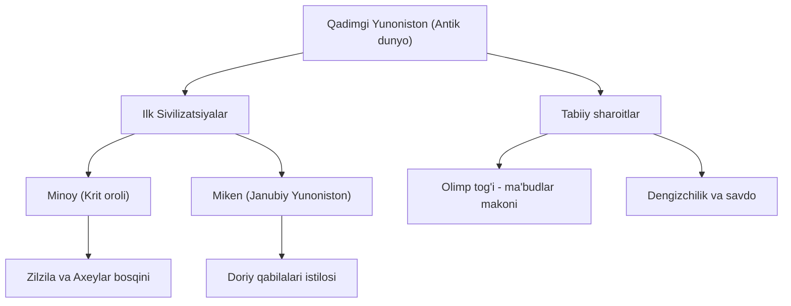

[cite_start]**Jahon Tarixi — 22-mavzu: Antik tarixning boshlanishi** [cite: 4, 39, 40]

**Darvoza iqtibosi (Gate Quote)**
> [cite_start]"Tarix hayotning haqiqiy oʻqituvchisidir. Insoniyatning tarixiy rivojlanishidan to'g'ri xulosa chiqarilsa, koʻplab xatolardan qochish mumkin." [cite: 14]

---

**1-Panel: Xulosa (Summary)**
[cite_start]Qadimgi Yunoniston — Bolqon yarimoroli va Oʻrta Yer dengizi orollarini oʻz ichiga olgan antik dunyoning beshigi hisoblanadi[cite: 39, 40]. [cite_start]Miloddan avvalgi 2-mingyillikda bu yerda dastlabki sivilizatsiyalar: Krit orolida **Minoy** va Janubiy Yunonistonda **Miken** sivilizatsiyalari vujudga kelgan[cite: 40, 67]. [cite_start]Tabiiy sharoitlar — togʻli hududlar va dengiz yaqinligi yunonlarni nafaqat dehqonchilik, balki mohir dengizchi hamda savdogar boʻlishga undagan[cite: 40, 41]. [cite_start]Ushbu davr sivilizatsiyalari turli tabiiy ofatlar va qoʻshni qabilalar bosqini natijasida inqirozga yuz tutgan boʻlsa-da, ular keyingi yuksalish davri uchun poydevor boʻlib xizmat qilgan[cite: 40].

---

**2-Panel: Yaxshiroq tushuntirish (Better Explanation)**
Qadimgi Yunoniston tarixi oʻziga xos geografik va ijtimoiy jarayonlar bilan ajralib turadi:

* [cite_start]**Geografiya:** Mamlakat shimoli-sharqida yunonlar maʼbudlar makoni deb hisoblagan eng baland choʻqqi — **Olimp togʻi** joylashgan[cite: 39, 40]. [cite_start]Hududning katta qismi togʻli boʻlgani bois, dehqonchilik asosan daryo vodiylarida olib borilgan[cite: 39, 40].
* **Ilk sivilizatsiyalar:**
    * [cite_start]**Minoy sivilizatsiyasi (Krit):** Afsonaviy podsho Minos nomi bilan atalgan[cite: 40]. [cite_start]Zilzila va vulqon otilishi natijasida vayron boʻlgan, soʻngra **axey** qabilalari tomonidan butunlay xarob qilingan[cite: 40, 67].
    * [cite_start]**Miken sivilizatsiyasi:** **Doriy** qabilalarining bostirib kirishi natijasida tugatilgan[cite: 40, 68].
* [cite_start]**Dengiz sayohatlari:** Yunonlar dengizchilikda mohir boʻlishgan, biroq kompas boʻlmagani sababli uzoq masofalarga faqat sohil yaqinida yoki oroldan orolga suzishgan[cite: 40, 41]. [cite_start]Tajribali dengizchilar Misr hamda Qora dengiz sohillariga qadar yetib borishgan[cite: 40, 41].



---

**3-Panel: Namunalar / Birlamchi manba (Primary Source)**
Tarixiy tadqiqotlar natijasida Miken va Krit madaniyatiga oid bebaho topilmalar aniqlangan. [cite_start]Masalan, Miken sivilizatsiyasiga oid **oltin niqoblar** va **oltin qadahlar** oʻsha davrdagi yuqori darajadagi zargarlik sanʼatidan dalolat beradi[cite: 40]. [cite_start]Shuningdek, Mikendagi mashhur **"Arslonlar darvozasi"** qadimgi meʼmorchilikning yuksak namunasidir[cite: 40]. [cite_start]Gerodot va Strabon kabi antik tarixchilarning asarlarida yunonlarning turmush tarzi va boshqa xalqlar bilan aloqalari haqida qimmatli maʼlumotlar saqlanib qolgan[cite: 17, 18].

---

**Xotira Saroyi (Memory Palace)**
Tasavvurimizda Qadimgi Yunoniston hududiga virtual sayohat qilamiz:

* **Saroy bekati: 1 — Olimp choʻqqisi:** Sayohatimizni shimoli-sharqdagi eng baland, bulutlar bilan qoplangan Olimp togʻidan boshlaymiz. [cite_start]Bu yerda maʼbudlar kengash qurayotganini tasavvur qiling[cite: 39, 40].
* **Saroy bekati: 2 — Krit saroyi (Knoss):** Janubga, Krit oroliga tushamiz. [cite_start]Bu yerda Minoy sivilizatsiyasining naqshinkor saroylarini va devorlardagi buqa tasvirlarini koʻramiz[cite: 40].
* **Saroy bekati: 3 — Miken qalʼasi:** Janubiy Yunonistonga oʻtib, ulkan toshlardan qurilgan Miken qalʼasiga kiramiz. [cite_start]Kirishda bizni magʻrur "Arslonlar darvozasi" kutib oladi[cite: 40].
* **Saroy bekati: 4 — Egey dengizi bandargohi:** Sohilga tushamiz. [cite_start]Bu yerda yunonlarning kichik eshkakli qayiqlar va yelkanli kemalar bilan sayohatga hozirlik koʻrayotganini kuzatamiz[cite: 40, 41].
* **Saroy bekati: 5 — Ziroatkor vodiylar:** Togʻlar orasidagi unumdor vodiylarga qaraymiz. [cite_start]U yerda dehqonlar mehnat qilib, uzum va zaytun yetishtirmoqdalar[cite: 39, 40].

---

**6-Panel: Nega bu muhim (Why This Matters)**
Qadimgi Yunoniston tarixi nafaqat oʻtmishni oʻrganish, balki zamonaviy dunyo poydevorini tushunish uchun ham muhimdir. [cite_start]Yunonistonning geografik oʻrni qanday qilib xalqni tadbirkorlik va kashfiyotlarga undaganini oʻrganish, bizga bugungi kunda ham resurslardan unumli foydalanishni oʻrgatadi[cite: 40]. Ushbu dars orqali Siz insoniyat taraqqiyoti yoʻlidagi ilk sivilizatsiyalarning qanchalik moʻrt boʻlishi mumkinligini va ularni asrab qolish uchun birdamlik muhimligini anglaysiz.

*Oʻylab koʻring:* Agar yunonlarda hali oʻsha davrda kompas boʻlganida, ularning dunyoni oʻrganish jarayoni qanday oʻzgargan boʻlar edi? (Ushbu savol orqali oʻz BOST maqsadingizni belgilang)[cite_start]. [cite: 40]

---
**Metadata JSON**

```json
{
  "lesson_id": "antik-tarixning-boshlanishi-22",
  "subject": "Jahon Tarixi",
  "family": "ijtimoiy-fanlar",
  "textbook_ref": {
    "pages": [85, 86, 87]
  }
}
```