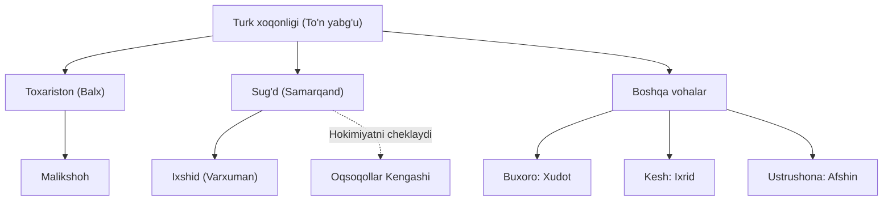

# 1-qism: Mahalliy hokimliklarning tashkil topishi (Preview)

> "Hukmdorning qudrati uning qanchalik ko'p yerlarni egallaganida emas, balki qaram xalqlarni qanday birlashtira olganidadir."
> **— Abu Rayhon Beruniy** > *[Davom etish uchun 5 soniya kuting...]*

## Xulosa: Turk xoqonligining bo'linishi va mahalliy boshqaruv

V–VII asrlarda O'rta Osiyo siyosiy hayotida katta o'zgarishlar yuz berdi. Turk xoqonligi o'z ichki ziddiyatlari va yirik hududlarni boshqarishdagi qiyinchiliklar tufayli asta-sekin parchalanib, mintaqada **15 dan ortiq mustaqil hokimliklar** vujudga keldi. Bu davrda har bir voha va shahar-davlat o'z mustaqilligini saqlab qolishga harakat qilar edi. 

**618–630-yillarda** xoqonlikni boshqargan **To'n yabg'u** siyosiy tarqoqlikni to'xtatish va markaziy hokimiyatni mustahkamlash uchun qat'iy islohotlar o'tkazdi. U barcha qaram hududlarni qattiq nazoratga olish maqsadida mahalliy hukmdorlarga turli darajadagi boshqaruv unvonlarini in'om etdi. Bu orqali u ularning mavqeini qonuniylashtirdi, lekin ayni paytda o'ziga tobe ekanliklarini ham ta'kidladi. 

Ushbu davrda eng yirik va nufuzli hokimliklardan biri **Toxariston** edi. Markazi **Balx** shahri bo'lgan bu ulkan hududning hukmdori *Malikshoh* unvoniga ega bo'ldi. Dastlab xoqon To'n yabg'u Sosoniylar podshosi **Xusrav** bilan yaxshi munosabatlar o'rnatish orqali Toxaristonning janubiy chegaralarini xavfsizlantirgan edi. 

Xoqonlikning iqtisodiy va madaniy markazi bo'lgan **Sug'd** vohasida (hozirgi Samarqand atroflari) hokimiyat o'ziga xos tarzda shakllandi. Voha hukmdori *Ixshid* unvoni bilan atalgan. Xususan, VII asrda yashagan Sug'd ixshidi **Varxuman** davrida davlat juda katta nufuzga erishdi. Sug'd tarkibiga kiruvchi yoki unga yondosh boshqa hududlar ham o'ziga xos unvonlar bilan boshqarilgan: **Buxoro** hukmdorlari *xudot*, **Kesh** hukmdorlari *ixrid*, **Ustrushona** hukmdorlari esa *afshin* deb atalgan. E'tiborli jihati, Sug'dda mutlaq monarxiya bo'lmagan — davlat boshqaruvida yirik yer egalari va boy savdogarlardan iborat **Oqsoqollar Kengashi** muhim rol o'ynagan va hatto podshoh hokimiyatini ham cheklab turishga qodir bo'lgan.

## Yaxshiroq tushuntirish

Darslikdagi ba'zi murakkab nuqtalarga oydinlik kiritamiz:

- **Nega bitta mintaqada turli xil unvonlar (ixshid, xudot, ixrid, afshin) ishlatilgan?**
Darslikda bu unvonlar shunchaki sanab o'tiladi. Aslida, bu xilmaxillik O'rta Osiyoning o'ta tarqoq bo'lganini va qattiq markazlashgan yagona davlat bo'lmaganini ko'rsatadi. Har bir voha azaldan o'zining sulolasi va an'analariga ega edi. To'n yabg'u ularni bitta nom ostida birlashtirishga kuchi yetmagani uchun, ularning qadimiy mahalliy unvonlarini saqlab qolgan holda o'ziga tobe qilgan.

- **"Oqsoqollar Kengashi" qanday qilib qonuniy podshohni cheklay olgan?**
Odatda qadimgi sharq davlatlarida podshoh cheksiz hokimiyatga ega bo'ladi degan tushuncha bor. Ammo Sug'd Buyuk Ipak yo'lidagi asosiy tijorat tuguni edi. Boy savdogarlar va katta yer egalari iqtisodiy jihatdan shu qadar qudratli ediki, davlat xazinasi ularning soliqlariga qaram bo'lib qolgan. Shu moliyaviy dastak orqali ular hukmdorning siyosiy va harbiy qarorlariga aralasha olgan.

- **To'n yabg'uning unvonlar tarqatishi nima uchun islohot deb ataladi?**
U shunchaki qog'oz tarqatmadi — u hokimiyat vertikalini (iyerarxiyasini) qurdi. Bunga qadar har bir mahalliy hukmdor o'zini mustaqil his qilar va xoqonga bo'ysungisi kelmasdi. Unvon berish orqali xoqon ularni o'z ma'muriyatining rasmiy xodimlariga, o'zining qonuniy vakillariga aylantirdi.

## Namunalar: Birlamchi manba

[IMAGE: Afrosiyob devoriy suratlari fragmenti — elchilarning qabuli | Siyosiy aloqalar va diplomatiyani ko'rsatish | source_hint: textbook_p.41]

Darslikda Afrosiyob (qadimgi Samarqand) xarobalaridan topilgan mashhur devoriy suratlar haqida so'z boradi. Unda Sug'd ixshidi Varxuman huzuriga kelgan turli davlat elchilari tasvirlangan.

> "Suratlarning birida Sug'd ixshidi Varxuman huzurida Chag'oniyon va Choch elchilari qabul qilinayotgani va ularning o'zaro diplomatik muloqoti aks ettirilgan."

**2 ta muhim xulosa:**
1. **Diplomatika madaniyati:** Bu davrda turli xonliklar va davlatlar o'rtasida qat'iy xalqaro qoidalar, o'zaro elchilar almashish tizimi mukammal ishlaganini ko'rsatadi.
2. **Sug'dning nufuzi:** Choch va Chag'oniyondek yirik hududlardan elchilarning aynan Samarqandga kelishi, Varxuman davrida Sug'dning O'rta Osiyodagi asosiy siyosiy markazlardan biriga aylanganini anglatadi.

**Tarixchining metodi:** Nega Varxuman aynan elchilar qabulini saroy devoriga chizdirgan? Tarixchilar bu savolni berish orqali vizual manbalarning maqsadini tushunishadi. Varxuman bu orqali o'z xalqiga va kelajak avlodlarga "Mening qudratimni boshqa davlatlar ham tan olib, elchi yubormoqda" degan siyosiy xabarni (legitimlikni) qoldirishni maqsad qilgan. Birlamchi manbalar doim ham faqat go'zallik uchun emas, siyosiy tashviqot uchun ham xizmat qiladi.

## Xotira Saroyi: 1-qism Bekatlari

Hokimliklar davrini eslab qolish uchun tasavvurimizda **Buyuk Ipak yo'li bo'ylab joylashgan Qadimgi Karvonsaroylar** bo'ylab harakatlanamiz. 

**1-Bekat: Xoqon chodiri (To'n yabg'u)**
→ Tasvir: Bahaybat kigiz chodir ichida xoqon To'n yabg'u 15 xil rangdagi qog'oz yorliqlarni (unvonlarni) havo shari kabi uchirib, mahalliy hokimlarga tarqatmoqda. Chodir ustida katta "618-630" raqamlari yozilgan bayroq hilpiramoqda.
→ Yodda: 618-630-yillarda To'n yabg'u 15 dan ortiq hokimliklarni birlashtirish uchun unvonlar tarqatgan.

**2-Bekat: Balx qal'asi darvozasi (Toxariston)**
→ Tasvir: Katta Balx darvozasi oldida podshoh boshiga juda og'ir, ustiga "Malikshoh" deb yozilgan oltin toj kiydirilmoqda. Uning bir tomonida Sosoniy Xusrav unga qarab jilmayib turibdi.
→ Yodda: Toxaristonning markazi Balx bo'lib, hukmdori Malikshoh atalgan; Xusrav bilan diplomatik aloqalar o'rnatilgan.

**3-Bekat: Afrosiyob qabulxonasi (Sug'd)**
→ Tasvir: Qabulxonada Sug'd ixshidi Varxuman o'tiribdi. Uning atrofida devorlar bo'ylab jonli elchilar (Chag'oniyon va Chochdan kelganlar) rasmga aylanib, devorga yopishib qolmoqda.
→ Yodda: Sug'd hukmdori Ixshid deyilgan (eng mashhuri Varxuman), Afrosiyobdan topilgan suratlar elchilar qabulini ko'rsatadi.

**4-Bekat: Uchta ko'prik (Buxoro, Kesh, Ustrushona)**
→ Tasvir: Uchta turli rangdagi ko'prik. Birida "Xudoy" so'zi tushirilgan kitob (Buxoro xudoti), ikkinchisida xirillab turgan soqov odam (Kesh ixridi), uchinchisida aylanib yurgan afsungar (Ustrushona afshini) o'tiribdi.
→ Yodda: Buxoroda xudot, Keshda ixrid, Ustrushonada afshin unvonlari qo'llanilgan.

**5-Bekat: Katta majlislar zali (Oqsoqollar Kengashi)**
→ Tasvir: Zal o'rtasida taxtda o'tirgan podshohni atrofdagi yirik qorinli savdogarlar va qariya oqsoqollar qalin arqonlar bilan bog'lab, unga qaror qabul qilishiga yo'l qo'ymay tortishmoqda.
→ Yodda: Sug'dda Oqsoqollar Kengashi podshoh hokimiyatini cheklab turgan.

## Nega bu muhim?

Tarixdagi bu jarayonlar bugungi hayotimizda ham o'z izlarini qoldirgan:
- **Ismlardagi tarix:** Bugungi kunda ham "Afshin" kabi ismlar xalqimiz orasida uchraydi. Bu so'z asrlar o'tsa-da, qadimgi Ustrushona hukmdorlari unvonidan saqlanib qolgan.
- **Hokimiyat bo'linishi qoidasi:** Oqsoqollar Kengashining hukmdor vakolatini cheklashi — bugungi kundagi parlamentarizm (xalq vakillarining davlat rahbarini nazorat qilishi)ning eng qadimiy ko'rinishlaridan biridir.
- **Markazlashuv va Tarqoqlik:** To'n yabg'uning unvonlar orqali boshqaruvni ushlab turish usuli bugungi yirik korporatsiyalar yoki federativ davlatlardagi markaz va viloyatlar o'rtasidagi munosabatlarga o'xshaydi.

> **Bugun Siz qadimgi hududlarimiz qanday qilib o'z mustaqilligini boshqaruv tizimi orqali saqlab qolgani haqida aynan nimani bilmoqchisiz?**