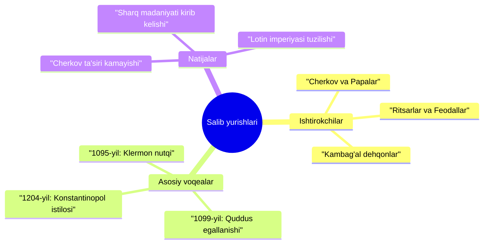

Assalomu alaykum! Biz **18-mavzu: "Salib yurishlari"** bo‘yicha uyga vazifa sessiyasini boshlaymiz. Sessiyaning har bir qismini bosqichma-bosqich ko‘rib chiqamiz.

Dastlab, **0-A faza: Preview (Kirish)** bilan tanishamiz.

---

### Gate Quote
> *"Bilim — bu kuch, ammo uni qanday maqsadda ishlatish insonning irodasiga bog'liq."*

---

### Panel 1 — Xulosa (Summary)
[cite_start]**Salib yurishlari** (1096–1270-yillar) — G‘arbiy Yevropa feodallarining Yaqin Sharqqa uyushtirgan bosqinchilik va talonchilik urushlari edi[cite: 968]. [cite_start]Ushbu yurishlarning rasmiy maqsadi xristianlar uchun muqaddas hisoblangan **Quddus** (Iyerusalim) shahrini va "payg‘ambar qabrini" musulmonlardan "ozod qilish" deb e'lon qilingan[cite: 971, 975]. [cite_start]Aslida esa, katolik cherkovi o‘z ta’sirini kengaytirishni, feodallar esa yangi yerlar va boyliklarni qo‘lga kiritishni ko‘zlaganlar[cite: 969, 983]. [cite_start]Deyarli ikki asr davom etgan sakkizta yirik yurish natijasida Yaqin Sharqda vaqtinchalik xristian davlatlari tuzilgan bo‘lsa-da, yakunda barcha hududlar musulmonlar qo‘liga qaytgan[cite: 1014, 1024].

---

### Panel 2 — Yaxshiroq tushuntirish (Better Explanation)
Salib yurishlari nafaqat urush, balki o‘rta asrlar jamiyatining barcha qatlamlarini qamrab olgan ijtimoiy harakat edi. Ishtirokchilarning maqsadlari turlicha bo‘lgan:
* [cite_start]**Ritsarlar:** Harbiy shuhrat va o‘lja ilinjida edi[cite: 983].
* [cite_start]**Dehqonlar:** Og‘ir hayotdan qutulib, "sut va asal daryo bo‘lib oqadigan" Sharqda baxtli yashashni orzu qilganlar[cite: 977, 983].
* [cite_start]**Cherkov:** G‘arbiy va Sharqiy cherkovlar o‘rtasidagi raqobatda ustunlikka erishishni istagan[cite: 944, 969].

[cite_start]Urushlar davomida maxsus **diniy-ritsarlik ordenlari** (Gospitalyerlar, Tampliyerlar, Tevtonlar) vujudga keldi[cite: 991]. [cite_start]Ular yarim rohib, yarim jangchi sifatida faoliyat yuritishgan[cite: 991]. 



---

### Panel 3 — Namunalar / Birlamchi manba (Primary Source)
[cite_start]Salib yurishlarining boshlanishiga **Papa Urban II ning 1095-yilda Klermon shahridagi nutqi** turtki bo‘ldi[cite: 974].

> **Manba parchasi:**
> [cite_start]*"U [Papa] Quddusdagi 'payg'ambar qabrini' musulmonlardan ozod etishga chaqiradi. Papa yurishda ishtirok etganlarga ularning gunohlari kechirilishini, halok bo'lganlar ruhining jannatga tushishini va'da qiladi. Urban II Falastin – 'muqaddas yer'ning boyliklari va hosildor ekanligini, u yerda 'sut va asal daryo bo'lib oqishini' ta'kidlaydi"*[cite: 975, 976, 977].

[cite_start]Xaloyiq bu nutqni *"Xudoning irodasi shu!"* degan hayqiriqlar bilan kutib olgan va kiyimlariga matodan qirqilgan **salib** (xoch) belgisini tika boshlagan[cite: 978, 979].

---

### Memory Palace (Xotira saroyi)
Bizning "xotira saroyimiz" — bu **Yaqin Sharq bo‘ylab o‘tadigan salibchilar yo‘li**:

1.  **Klermon maydoni (Fransiya):** Kirishda Papa Urban II baland minbarda turibdi (Yurishlarning boshlanishi).
2.  [cite_start]**Konstantinopol darvozasi:** Imperator Aleksey I ritsarlardan vassallik qasamyodini qabul qilmoqda (Birinchi yurish)[cite: 990].
3.  [cite_start]**Quddus devorlari:** Tepada xristian, musulmon va yahudiylarning muqaddas ramzlari (Yurishning asosiy maqsadi)[cite: 971].
4.  [cite_start]**Ritsarlar qarorgohi:** Tampliyerlar oq yopinchig‘ida qizil but, Tevtonlar esa oq yopinchig‘ida qora but bilan turishibdi (Ordenlar farqi)[cite: 992].
5.  [cite_start]**Venetsiya bandargohi:** To'rtinchi yurish kemalari Falastin o‘rniga Vizantiyaga qarab ketmoqda[cite: 1008].
6.  [cite_start]**Kema kemasi:** So‘nggi salibchilar umidsiz holda Yevropaga qaytishmoqda (Yurishlarning tugashi)[cite: 1019].

---

### Panel 6 — Nega bu muhim (Why This Matters)
Salib yurishlari insoniyat tarixidagi eng yirik to‘qnashuvlardan biri bo‘lishiga qaramay, u madaniyatlar almashinuviga ham xizmat qildi. [cite_start]Yevropaliklar Sharqdan shakarqamish, sholi, ko‘zgularni o‘rgandilar, gigiyena va savdo madaniyatini yuksaltirdilar[cite: 1023]. [cite_start]Ammo bu yurishlar cherkovning siyosiy obro‘sini tushirib yubordi va millionlab odamlarning o'limiga sabab bo'ldi[cite: 1024].

**BOST Mirror (O‘rganish maqsadi):**
Siz ushbu dars orqali salib yurishlarining sabablari, asosiy bosqichlari va ularning Yevropa hamda Osiyo taqdiriga ko‘rsatgan ta’sirini tushunib olasiz.

---
**0-A faza tugadi. Keyingi bosqich — Flash Card (Fleshkartalar)ga o'tamizmi?**

```json
{
  "lesson_id": "salib_yurishlari_18",
  "subject": "Jahon Tarixi",
  "family": "ijtimoiy-fanlar",
  "textbook_ref": {
    "book": "7-sinf Jahon Tarixi 2022",
    "topic": 18,
    "pages": "107-116"
  },
  "parameters": {
    "milliylik": "low",
    "language": "uz"
  }
}
```