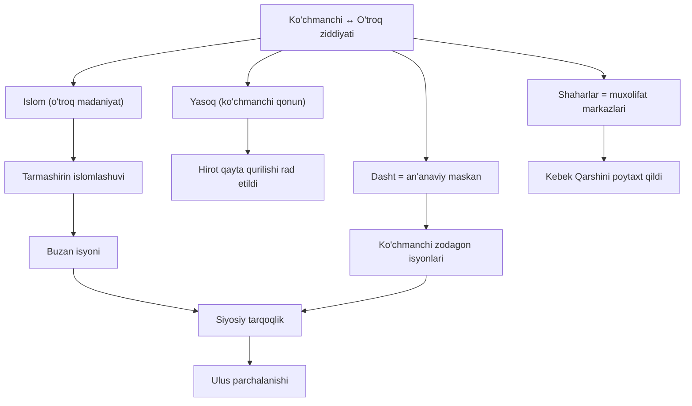

# Phase 0-A — Preview

## Gate Quote

> **"Turli xalqlarning ilmini oʻrganish — dunyoqarashni kengaytiradi va adovatni yoʻqotadi."**
>
> — Abu Rayhon al-Beruniy

*[5 soniyalik kutish — "Davom etish" tugmasi 5 soniyadan keyin yoqiladi]*

**Tanlash asosi:** 55% milliy (Beruniy — milliy meros). Dars Movarounnahr yerida mo'g'ul-turonlik madaniy aralashuv haqida; Beruniyning fikri "madaniyatlarni oʻrganish" haqida — mavzuga toʻgʻri keladi.

---

## Panel 1 — Xulosa (Summary)

### Qatlam 1 — Rasmiy izoh

1225-yil avgustda Chingizxon oʻzining ulkan imperiyasini toʻrt oʻgʻliga ulus qilib boʻlib berdi. Bu boʻlinishda ikkinchi oʻgʻli **Chigʻatoy** Sharqiy Turkiston, Yettisuv, Movarounnahr va hozirgi Afgʻonistonning katta qismini — yaʼni Markaziy Osiyoning yuragini — qabul qildi. Ulusning poytaxti dastlab **Olmaliq** (hozirgi Xitoy hududida) edi; keyinchalik Kebekxon davrida **Qarshi**ga koʻchirildi.

Chigʻatoy 1242-yili vafot etgach, ulus ichida taxt uchun uzoq kurashlar boshlandi. Bu davrda **Yalavochlar xonadoni** — Mahmud Yalavoch va uning oʻgʻli Masʼudbek — Movarounnahrni boshqarib, shaharlarni sekin-asta tikladi. Masʼudbek 1271-yili ulusning 16 ta shahri va viloyatida bir xil vaznli kumush tangalarni zarb ettirib, ilk umumulusli pul islohotini amalga oshirdi.

XIV asr boshida **Kebekxon** (1318–1326) ulusning eng ahamiyatli hukmdoriga aylandi: u davlatni "tuman" deb nomlangan 10 minglik harbiy-maʼmuriy birliklarga boʻldi, poytaxtni Qashqadaryo vohasiga koʻchirdi va 1321-yili "kepaki" deb nomlangan yangi kumush tangalarni chiqardi. Uning ukasi **Alouddin Tarmashirin** islomni ulusning rasmiy diniga aylantirdi.

Lekin bu islomlashuv va oʻtroqlashuv koʻchmanchi moʻgʻul zodagonlarining qarshiligini keltirib chiqardi. Buzan ibn Duva Temurning isyoni, 1338–1339 yillardagi sharqiy qismdagi vabo epidemiyasi (keyinchalik Yevropaga tarqalib "Qora oʻlim"ga aylanib, aholining 30–40 foizini yoʻq qildi), hamda 1343-yili Qozonxonning taxtga chiqishi — bularning barchasi Chigʻatoy ulusining siyosiy tarqoqlikka uchraganini koʻrsatdi. Bu tarqoqlik keyinchalik Amir Temur davri uchun sharoit yaratdi.

### Qatlam 2 — Sodda soʻzlar

Bu darsda Siz Chingizxon oʻlganidan soʻng Markaziy Osiyoni kim va qanday boshqargan — va nega oxirida davlat ichdan parchalanganini oʻrganasiz. Hikoya toʻrt bosqichdan iborat: (1) mo'g'ullar istilosi va vayronaliklari, (2) Yalavochlar davrida sekin-asta tiklanish, (3) Kebekxon va Tarmashirin davridagi islohotlar, (4) ichki ziddiyatlar sababli parchalanish. Bu bilim Sizga Amir Temurning kelishini tushunishga imkon beradi — chunki uning buyukligi aynan Chigʻatoy ulusi zaiflashgan paytda boshlandi.

---

## Panel 2 — Yaxshiroq tushuntirish (Better Explanation)

### Qatlam 1 — Rasmiy izoh

Chigʻatoy ulusining 120 yillik tarixini tushunish uchun bitta asosiy ramkani bilish kerak: **koʻchmanchi va oʻtroq hayot tarzi oʻrtasidagi ziddiyat.** Bu ramka darslikda toʻgʻridan-toʻgʻri nomlanmagan, lekin ulusdagi deyarli barcha muhim voqealarning ostida aynan shu kuch yotadi.

Moʻgʻullar — ochiq dashtlarda, otda yashaydigan, **Yasoq** deb nomlangan ovchilik-bosqinchilik-oila qonuniga sodiq xalq. Turon (Movarounnahr) esa — ming yillik shaharlar, sugʻorma dehqonchilik, islom madrasalari va kitob madaniyati yurti. Moʻgʻullar Turonni bosib olganlarida, ular oʻz turmush tarzini shu yerga oʻrnatishni istadilar. Lekin sekin-asta aksincha boʻldi: **Oʻlka moʻgʻullarni oʻz qoliplariga singdirib boshladi.** Bu singish — har bir siyosiy voqeada qarshilik uygʻotdi.

Ushbu ramka darsdagi bir qator murakkab savollarga bitta javob beradi:

- **Nega Chingizxon va Chigʻatoy Hirot shahrini qayta qurishdan bosh tortdilar?** → Yasoq shaharlarni muxolifat markazi deb koʻrardi (koʻchmanchi mantiq).
- **Nega Tarmashirinning islomga oʻtishi Buzan isyonini keltirib chiqardi?** → Islom — oʻtroq madaniyat belgisi; Yasoqqa qarshi hujum sifatida qabul qilindi.
- **Nega Kebekxon poytaxtni Qarshiga koʻchirdi?** → Qashqadaryo vohasi — dasht va shahar chegarasidagi kompromiss joy: atrofi ov uchun qulay (koʻchmanchi), markazi shaharga yaqin (oʻtroq).
- **Nega ulus oxirida parchalandi?** → Gʻarbiy qism (oʻtroq, musulmon, savdogar) va Sharqiy qism (koʻchmanchi, Yasoqchi) oʻrtasidagi madaniy yoriq kengayib ketdi.

### Qatlam 2 — Sodda soʻzlar

Moʻgʻullar — otda, dashtda, chodirda yashaydigan odamlar edi. Bu yerning xalqi esa — shaharda, dehqonchilik bilan, masjidlar bilan. Ikki hayot tarzi bir-biriga qarama-qarshi. Chigʻatoy ulusi tarixidagi har bir katta voqea — shu ikki tomon oʻrtasidagi kurash natijasi. Kimdir shaharlarni tiklamoqchi boʻlsa, koʻchmanchilar norozi boʻlardi. Kimdir islomni qabul qilsa, zodagonlar isyon koʻtarardi. Oxirida bu ziddiyat davlatni ichdan yoʻq qildi.

### Mind Map — Ziddiyat ramkasi

---

## Panel 3 — Namunalar: Birlamchi manba (Primary Source)

Tarixchilar oʻtmishni oʻrganishda **birlamchi manbalar** — yaʼni oʻsha davrda yashagan kishilarning yozma guvohliklaridan — foydalanadilar. Chigʻatoy ulusi uchun eng qimmatli birlamchi manbalardan biri — arab sayyohi **Ibn Battuta**ning (1304–1369) *Sayohatnoma* asari. U 14-asrda Chigʻatoy ulusiga tashrif buyurib, Tarmashirinxon bilan shaxsan uchrashgan va oʻz koʻzi bilan koʻrgan voqealarini yozib qoldirgan.

Darslikda keltirilgan quyidagi parcha — Tarmashirinxonning masjiddagi bir voqeasi haqida:

> "Sultonimiz tahoratlarini tugallamagunicha namozni boshlamay, kutib turar ekansiz", dedi [xon mahrami imomga]. **Imom oʻrnidan turib: "Namoz Xudo uchunmi yoki Tarmashirin uchunmi?"** U muazzin (azon aytuvchi)ga namozni boshlashni buyurdi. Sulton masjidga kirib kelganda ikki rakat namoz oʻqib boʻlingan edi. Shunda u qolgan ikki rakat namozni kelgan joyidan tugalladi. U namozni odamlar poyabzallarini yechib qoldiradigan joyda, masjid ostonasida oʻtirib oʻqidi.

Bu kichik sahnadan tarixchi ikkita katta xulosa chiqaradi:

**1. Imomning harakati — Yasoqqa qarshi islom tamoyili.** Imom — dinshunos — hukmdorni kutmadi. Uning savoli: "Namoz Xudo uchunmi yoki Tarmashirin uchunmi?" Bu jumla islom taʼlimoti (barcha Alloh oldida teng) va moʻgʻul anʼanasi (xon har narsa ustida) oʻrtasidagi toʻqnashuvni aniq koʻrsatadi.

**2. Tarmashirinning javobi — haqiqiy islomiy sodiqlik.** Sulton — mutlaq hukmdor sifatida — jazo bermadi. Aksincha, sodiq muʼmin sifatida masjid ostonasida, hamma bilan tengma-teng namozni davom ettirdi. Bu — Chigʻatoy xonining islomga haqiqiy sodiqligini koʻrsatadi. Va aynan shu sodiqligi uning koʻchmanchi moʻgʻul zodagonlarida norozilik uygʻotdi — ular Yasoqni unutgan sultonga qarshi Buzan atrofida birlashdilar.

**Tarixchining metodi:** Birlamchi manbani oʻqiganda doim savol bering — "Muallif nima uchun aynan bu voqeani yozib qoldirdi?" Ibn Battuta bu sahnani Tarmashirinning diyonatini taʼkidlash uchun yozgan. Shunga koʻra, manbaga tanqidiy munosabatda boʻlish kerak — u haqiqatni koʻrsatadi, lekin tanlangan haqiqatni.

---

## Memory Palace — Buyuk Ipak Yoʻli bekatlari

### Usul haqida

Bugungi darsda oʻnlab ismlar, sanalar va joylar bor. Ularni mustahkam yodda saqlash uchun — **Memory Palace** (Xotira Saroyi) usulidan foydalanamiz. Bu — Tony Buzan qatʼiy tavsiya etgan va xalqaro xotira chempionlari ishlatadigan usul. Maʼnosi: bilimni tanish joyga "joylashtirish" va keyin shu joyni aqlda aylanib chiqish orqali eslash.

Bizning saroyimiz — **Buyuk Ipak Yoʻlining Chigʻatoy ulusi orqali oʻtadigan 8 bekati.** Koʻz oldingizga keltirib, har birida nima boʻlganini mustahkamlang. Qoidalar:

- Tasvir qanchalik **gʻayritabiiy, kulgili yoki kuchli** boʻlsa, shunchalik mustahkam eslanadi
- Bekatni aylanib chiqqanda — tartibni saqlang (1→2→3...)
- Phase 0-B, 1, 3, va ayniqsa Phase 5 da shu saroyga qaytamiz

### Bekatlar

**1-Bekat: OLMALIQ** *(Poytaxt 1224–1266)*
→ Tasvir: Chigʻatoy otasining xaritasi oldida turgan, qoʻlida Yasoq kitobini ushlab. Uning oldida ulkan yoʻlning qurilish loyihasi. 1242-yili shu yerda vafot etadi.
→ Yodda: **Chigʻatoyxon, Yasoq qonuni, 1242 vafot, Ili vodiysiga yangi yoʻl**

**2-Bekat: BUXORO** *(Yalavoch boshqaruv markazi)*
→ Tasvir: Boy savdogar Mahmud Yalavoch oltin darbozada sovgʻa tarqatmoqda. Yonida oʻgʻli Masʼudbek — qoʻlida ulkan madrasa loyihasi (1000 talabalik Masʼudiya).
→ Yodda: **Mahmud Yalavoch, Masʼudbek (1238–1289), Masʼudiya madrasa, 1271 pul islohoti — 16 shaharda bir xil kumush tanga**

**3-Bekat: SAMARQAND** *(Vayronlik va sekin tiklanish)*
→ Tasvir: Qoʻrgʻoshin nova toʻgʻonining yorilgan tosh boʻlaklari. Atrof sukut. Keyin sekin-asta ustaxonalar va bozor tiriklashadi.
→ Yodda: **Chingizxon istilosi oqibatlari, shaharlarning oʻlim-tirilish davri**

**4-Bekat: QARSHI** *(Kebekxon davri 1318–1326)*
→ Tasvir: Kebekxon yangi "qarsh"ida (saroy) oʻtiradi. Tuman qoʻmondonlari oldida yigʻilishmoqda. Tanga zarbxonasida "kepaki" chiqarilmoqda — har biri 8 grammdan ortiq.
→ Yodda: **Kebekxon (1318–1326), tuman tizimi, 1321 kepaki islohoti, 1 dinor = 6 dirham, "Qarshi" nomining kelib chiqishi**

**5-Bekat: OHANGARON** *(Toshkent vohasida — ilk islomlashuv)*
→ Tasvir: Muborakshohxon masjidda, shayx oldida — Islomni qabul qilayotgani eʼlon qilinmoqda. Moʻgʻul zodagonlarining yuzi gʻarazli.
→ Yodda: **Muborakshoh — Chigʻatoy ulusining ilk musulmon xoni, Ohangaron eʼlonnomasi**

**6-Bekat: XOʻJAND** *(Jang maydoni)*
→ Tasvir: Muborakshoh va Baroqxon qoʻshinlari daryo boʻyida yuzma-yuz. Muborakshoh taxtdan agʻdariladi.
→ Yodda: **Baroqxon (1264 taxtga chiqdi, 1271 vafot), Xoʻjand jangi**

**7-Bekat: GʻAZNA** *(Tarmashirinning oxiri)*
→ Tasvir: Tarmashirinxon Gʻaznaga qoʻshin toʻplash uchun chiqqan. Yoʻlda tutib olinadi va qatl etiladi. Buzan taxtga chiqadi.
→ Yodda: **Alouddin Tarmashirin (Sulton al-Aʼzam), islomni rasmiy din qildi, Buzan ibn Duva Temur isyoni**

**8-Bekat: TERMIZ** *("Madinat ar-rijol" — Mardlar shahri)*
→ Tasvir: Termiz hukmdori Ali al-Mulk shahar devorida — qoʻlida qilich — Buzanga qarshi oxirgi mudofaa. U halok boʻladi, Buzan ham keyin oʻz amirlari tomonidan oʻldiriladi.
→ Yodda: **Termizning qahramonligi, "Madinat ar-rijol" unvoni, Buzanning oʻz amirlari tomonidan oʻldirilishi**

*(Saroy qurildi. Phase 5 Consolidationda — toʻliq aylanib chiqamiz.)*

---

## Panel 6 — Nega bu muhim (Why This Matters)

Chigʻatoy ulusi 700 yil avval parchalangan boʻlsa-da, uning izlari bugungi dunyoda saqlanib qolgan. Uchta aniq misol:

**1. Qarshi shahri (Qashqadaryo viloyati).** Bugungi Qarshi — Oʻzbekistondagi yirik viloyat markazi, yarim million aholi. Uning aynan shu nomi — Kebekxon 1318-yilda Nasaf shahri yaqinida qurgan saroyidan keladi. "Qarshi" qadimgi turkiy tilda "saroy" degan maʼnoni bildirgan. Har safar "Qarshi" deganingizda — Siz 700 yil oldingi Chigʻatoy tarixini tilga olyapsiz.

**2. Rus "kopeyka" pul birligi.** Rossiyada va boshqa sobiq Ittifoq davlatlarida bugungacha "kopeyka" — Kebekxonning 1321-yilda zarb ettirgan "kepaki" tangalarning buzilgan shaklidir. Chigʻatoy ulusining iqtisodiy taʼsiri Oltin Oʻrda va rus knyazliklari orqali tarqalib, bu nom asrlar davomida saqlanib qolgan.

**3. "Qora oʻlim" (Black Death).** 1338–1339 yillarda Chigʻatoy ulusining sharqiy qismida tarqalgan vabo epidemiyasi — karvonlar va sayohatchilar orqali — 1340-yillar ikkinchi yarmida Yevropaga yetib bordi. U yerda "Qora oʻlim" deb nomlanib, Yevropa aholisining **30–40 foizini** yoʻq qildi. Bu insoniyat tarixining eng dahshatli epidemiyalaridan biri. **Markaziy Osiyoda boshlangan voqea — jahon tarixini oʻzgartirdi.**

Yaʼni: Chigʻatoy ulusi — mahalliy tarix emas, balki jahon tarixining bir qismi. Siz oʻrganayotgan narsalar — bugungi nomlar, pullar va hatto kasalliklarning ildiziga bogʻlangan. **Tarix — bugungi dunyomizning xomashyosi.**

### Oʻquv maqsadi (BOST)

> **Bugun Siz Chigʻatoy Ulusi haqida aynan nimani bilmoqchisiz?**
>
> *(Bir yoki ikki jumla bilan javob bering. Javob keyin Phase 7 Reflectionda oʻz maqsadingizga yetganingizni tekshirish uchun ishlatiladi.)*

---

**Phase 0-A tugadi.** Keyingi: Phase 0-B Flash Cards.

*Taxmini oʻqish vaqti: 15 daqiqa.*
