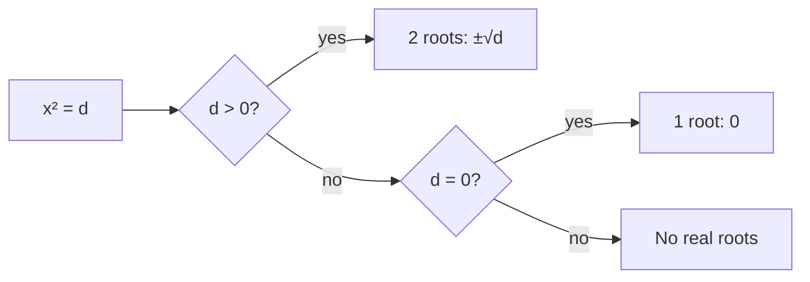

# Visual Generation

## Rule

Any concept that is spatial, relational, procedural, or geometric MUST have a visual aid generated alongside the text explanation. Text-only teaching is incomplete for these concept types. If the concept can be drawn, draw it.

## When to generate visuals

| Concept type | Visual required | Examples |
|-------------|:---:|---------|
| Geometric shape or spatial relationship | ✅ | Rectangle dimensions, coordinate plane, angle diagram, 3D shapes |
| Graph or function plot | ✅ | Parabola y = x², linear function, trigonometric wave |
| Process or sequence | ✅ | Chemical reaction chain, algorithm flowchart, historical timeline |
| State diagram or decision tree | ✅ | Method selection (sqrt vs factor), OS process states, grammar parse tree |
| Comparison or relationship map | ✅ | Venn diagram, cause-effect map, classification hierarchy |
| Number line or scale | ✅ | Root positions on number line, inequality ranges, temperature scale |
| Data visualization | ✅ | Bar chart (braking distance), pie chart (distribution), scatter plot |
| Pure vocabulary / terminology | ❌ | Word definitions, pronoun tables — text is sufficient |
| Abstract reasoning without spatial component | ❌ | "Why does a ≠ 0" — Socratic, not visual |

Rule of thumb: if a textbook would include a figure here, the homework must include one too.

## Format hierarchy

Use the highest-quality format the production environment supports:

| Priority | Format | When to use | Rendering |
|:---:|--------|------------|-----------|
| 1 | **SVG** (inline) | Production output. Geometric shapes, graphs, coordinate planes, custom diagrams. | Embedded directly in HTML or Markdown as `<svg>` block. |
| 2 | **Mermaid DSL** | Process diagrams, flowcharts, state machines, decision trees, mind maps. | Rendered by Mermaid.js in frontend. Agent emits text DSL, frontend handles rendering. |
| 3 | **ASCII art** | Fallback only — prototyping, plain-text environments where SVG/Mermaid unavailable. | Wrapped in `<pre><code>` monospace block. |

Agent instruction: **default to SVG.** Use Mermaid when the concept is a directed graph or flowchart (Mermaid handles these more cleanly than hand-drawn SVG). Fall back to ASCII only if the output environment cannot render SVG or Mermaid.

## SVG specification

### Size and layout
- `viewBox` based, NOT fixed width/height — scales to container
- Recommended viewBox: `0 0 400 300` (landscape) or `0 0 300 400` (portrait)
- Max rendered width: 400px on mobile (fits within 90vw card)
- Min touch target for interactive elements: 44×44px

### Colors
Use CSS custom properties from the app theme so visuals match the UI:

| Element | Color variable | Fallback |
|---------|---------------|----------|
| Primary lines/shapes | `var(--accent)` | `#34c759` (green) |
| Secondary lines | `var(--text-muted)` | `#636366` |
| Labels/text | `var(--text)` | `#1c1c1e` |
| Background fill | `var(--surface)` | `#ffffff` |
| Highlight/emphasis | `var(--accent)` at 20% opacity | `rgba(52,199,89,0.2)` |
| Grid lines | `var(--dot)` | `#d1d1d6` |

### Typography inside SVG
- Font: system stack (`-apple-system, BlinkMacSystemFont, sans-serif`)
- Label size: 13-16px
- Title size: 18-20px
- Math notation: use `<text>` with Unicode symbols (±, √, ², ≠, →) — no MathJax dependency

### Accessibility (mandatory)
Every SVG MUST include:
- `<title>` — short descriptive title (e.g., "Parabola y = x² crossing x-axis at two points")
- `<desc>` — full text description of what the visual shows (consumed by screen readers)
- `role="img"` on the SVG element
- `aria-labelledby` pointing to title + desc IDs
- No information conveyed by color alone (use shapes + labels + patterns)

### Quality rules
- Clean lines — no jagged edges, no overlapping labels
- Labeled axes on all graphs (x, y with units)
- Grid lines on coordinate planes (subtle, using --dot color)
- Arrows on directed edges (processes, timelines)
- Legend when >2 colors or series are present

## Mermaid DSL specification

For process/state/decision diagrams, agent emits Mermaid text:



Frontend renders with Mermaid.js. Agent does NOT produce the SVG — only the DSL text.

Mermaid style overrides (applied by frontend):
- Node fill: `var(--surface)` with `var(--accent)` border
- Edge color: `var(--text-muted)`
- Font: system stack, 14px
- Direction: `LR` (left-to-right) for processes, `TD` (top-down) for hierarchies

## Family-specific visual requirements

### Aniq Fanlar (Math)
- **Coordinate planes** for function graphs (parabolas, linear, etc.)
- **Geometric shapes** with labeled dimensions (rectangles, triangles, circles)
- **Number lines** for root positions and inequality ranges
- **Factor-pair tables** as styled SVG tables (not ASCII)
- **Step-by-step derivation visuals** — show the algebra as a sequence of connected boxes if the derivation has ≥3 steps

### Tabiy Fanlar (Natural Sciences)
- **Process diagrams** (photosynthesis, water cycle, circuit diagrams)
- **Laboratory apparatus** illustrations
- **Molecular structures** (simplified — bonds and atoms, not 3D renders)
- **Force/energy diagrams** (vectors, free body diagrams)
- **Data charts** from experiment results

### Til Fanlar (Languages)
- **Minimal visuals** — language learning is text-heavy by nature
- **Grammar parse trees** when explaining sentence structure (Mermaid `graph TD`)
- **Vocabulary concept maps** when clustering related words
- **Timeline** for literature history (author periods, literary movements)

### Ijtimoiy Fanlar (History / Social Sciences)
- **Timelines** (horizontal, labeled, scaled to period)
- **Maps** (simplified SVG outlines — country borders, trade routes, battle positions)
- **Cause-effect diagrams** (Mermaid flowcharts)
- **Comparison tables** as styled SVG (two-column, side-by-side)

## Phase-specific visual placement

| Phase | Visual frequency | Typical placement |
|-------|:---:|---|
| 0-A Preview | 1-3 per session | Panels 2 (Better Explanation), 3 (Examples), 4 (Origin) |
| 0-B Flash Cards | 0-2 per session | Card backs for spatial/geometric concepts |
| 1 Memory Sprint | 0 | Not needed — tap-only recognition items |
| 3 Game Breaks | 0-1 | Game boards rendered by game engine, not by content generator |
| 4 Real-Life | 1-2 | Scenario illustration, result visualization |
| 6 Final Challenge | 0-1 | Problem diagram if geometric |
| 7 Reflection | 1 | Skill breakdown bar chart on end screen |

## Agent production instruction

When generating homework content, for each phase:

1. **Scan the content** for any concept that matches the "When to generate" table above
2. **Decide format** — SVG for shapes/graphs/custom, Mermaid for processes/trees/flows
3. **Generate the visual** inline with the content (not as a separate attachment)
4. **Include alt-text** (title + desc) for accessibility
5. **Verify** the visual matches the text — a diagram that contradicts the explanation is worse than no diagram

If the agent cannot produce SVG directly (model limitation), emit a structured placeholder:

```json
{
  "visual_type": "coordinate_plane",
  "title": "Parabola y = x² crossing horizontal line y = 25",
  "elements": [
    {"type": "curve", "equation": "y = x^2", "range": [-8, 8]},
    {"type": "horizontal_line", "y": 25},
    {"type": "point", "x": 5, "y": 25, "label": "x₁ = 5"},
    {"type": "point", "x": -5, "y": 25, "label": "x₂ = -5"}
  ],
  "axes": {"x": {"label": "x", "range": [-8, 8]}, "y": {"label": "y", "range": [0, 30]}}
}
```

A downstream rendering agent or frontend component converts this JSON to SVG. This keeps the content agent focused on WHAT to show, not pixel-level rendering.

## Cross-references

- `01-phases/phase-0a-preview.md` — primary consumer (1-3 visuals per Preview)
- `01-phases/phase-0b-flashcards.md` — optional consumer (card back diagrams)
- `01-phases/phase-04-real-life.md` — scenario illustrations
- `01-phases/phase-06-final-challenge.md` — problem diagrams
- `02-families/family-aniq-fanlar.md` — Math-specific visual requirements
- `05-builder/homework-builder.md` — COMPOSE step includes visual generation
- `05-builder/output-schema.md` — SVG/Mermaid block types in output format

## Verification

1. Every geometric/spatial concept in Preview has an accompanying visual (SVG or Mermaid)
2. Every SVG has `<title>` and `<desc>` elements
3. No information conveyed by color alone
4. Mermaid DSL is syntactically valid (parseable by Mermaid.js)
5. Visual matches the text explanation (no contradictions)
6. Fallback ASCII art used ONLY when SVG/Mermaid unavailable
